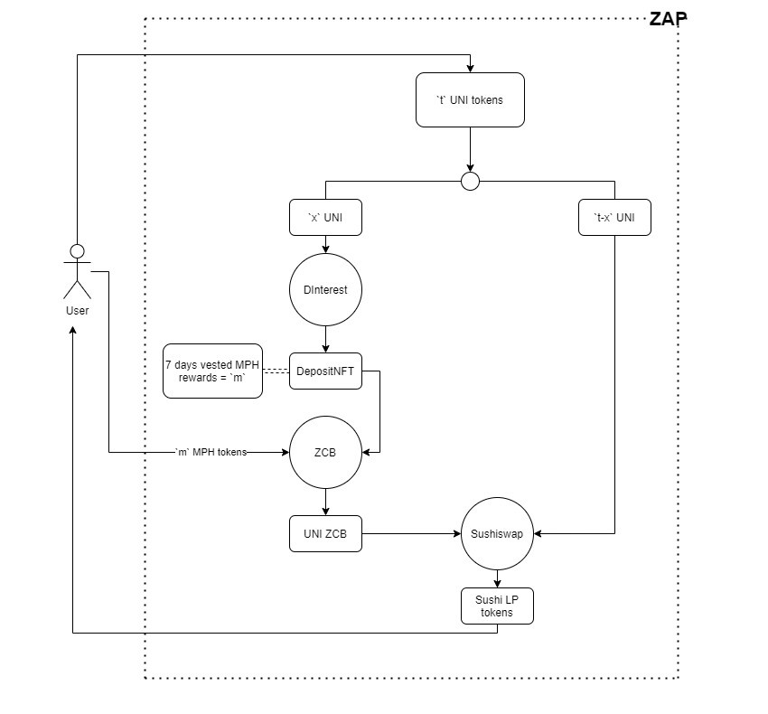
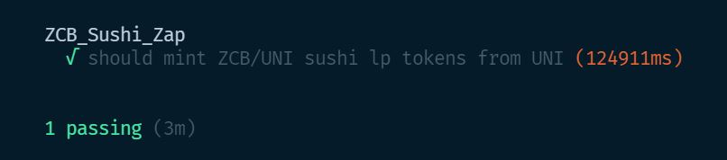

# 88MPH ZCB Sushi Zap

**Problem:** Currently it takes a ton of steps to get to providing liquidity to Zero-Coupon Bond (ZCB) & Native token Sushiswap LP.

**Solution:** One-click Zap that converts Native tokens -> FIRB -> ZCB, and provides liquidity to Native token / ZCB Pool!

### Full working of the contract:

### Repo set up

`yarn install`

Create `.env` file and add `MAINNET_NODE_URL=` with RPC endpoint to Ethereum Node.

### Run tests on Forked Mainnet

`yarn test`

**Output:**

